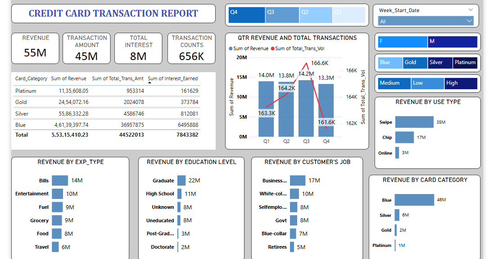
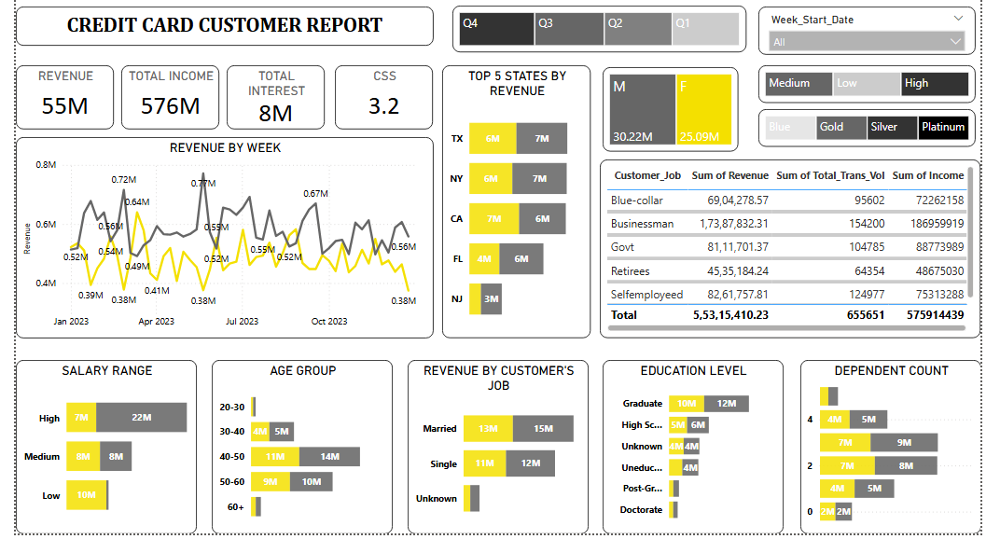

# Credit-Card-Transactions-and-Customer-Analysis-Dashboard
💳 Credit Card Analysis Dashboard (Power BI)

📌 Project Overview
This project presents an analysis of credit card transactions and customer behavior using Power BI. It consists of two interactive dashboards:

1. Credit Card Transaction Report
2. Credit Card Customer Report
The project focuses on identifying revenue patterns, customer segmentation, and usage behavior.

📊 Dashboard 1: Credit Card Transaction Report
🔹 Key KPIs:
- Total Revenue
- Total Transaction Amount
- Total Interest
- Total Transaction Count
 
👥 Dashboard 2: Credit Card Customer Report
🔹 Key KPIs:
- Total Income
- Total Revenue
- Total Interest
- Customer Satisfaction Score (CSS)

🛠️ Tools & Technologies Used
- Power BI
- Excel (Data Source)
- Data Cleaning & Transformation.

🎯 Key Insights
- Identifies high-revenue customer segments
- Highlights spending behavior across different demographics
- Tracks revenue trends over time
- Provides insights into credit card usage pattern.

📸 Dashboard Preview
### Credit Card Transaction Dashboard

### Credit Card Customer Dashboard

